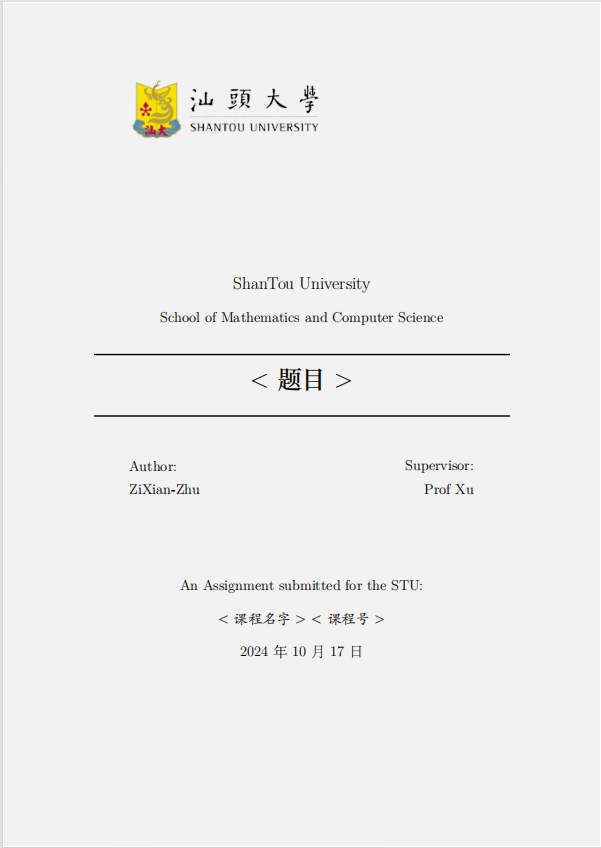
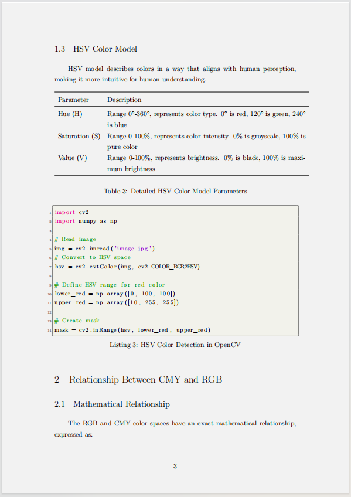

<!--
 * @Author: SheathedSharp z404878860@163.com
 * @Date: 2024-07-14 09:38:59
-->
### StuLatex
Shantou University Assignment Submission Template (LATEX Version)

  
      |    
  

## Introduction
Welcome to the GitHub repository for the "Shantou University Assignment Submission Template (LATEX Version)"! This repository provides a LATEX template specifically designed for Shantou University students to help standardize and beautify the formatting of their assignments. The template adheres to Shantou University's assignment format requirements, is easy to use, and is suitable for various types of assignments and reports.

## Usage Instructions
1. **Clone or Download the Repository**:
    - Clone the repository by entering the following command in your terminal or command line:
    `git clone https://github.com/SheathedSharp/StuLatex.git`
    - Alternatively, click the green "Code" button on the repository page and select "Download ZIP" to download the compressed package.
2. **Use Overleaf to Write Your Assignment**:
    - Upload the project to Overleaf
    - Select the downloaded resource package (in zip format)
    - In the compiler options, select the `XeLaTex` compiler

3. **Use a Local LATEX Compiler to Write Your Assignment**:
   - Install LATEX Environment: If you have not installed LATEX yet, please install a complete LATEX distribution such as TeX Live (suitable for all platforms) or MikTeX (suitable for Windows). Alternatively, you can install it directly using Homebrew with the command `brew install --cask mactex-no-gui`.
   - Open VSCode and install the `LaTeX Workshop` extension.
   - Configure the compilation environment; please search for detailed instructions online.

Note: Modify the cover in `cover.tex` and the main content in `main.tex`.

## Screenshot

